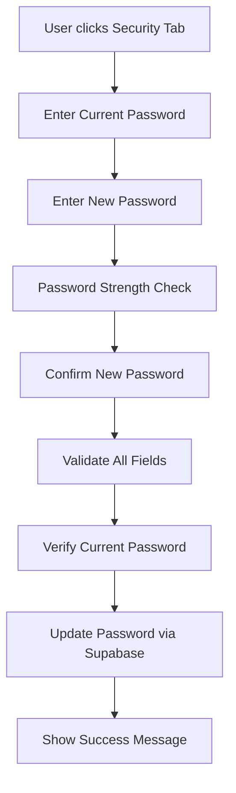
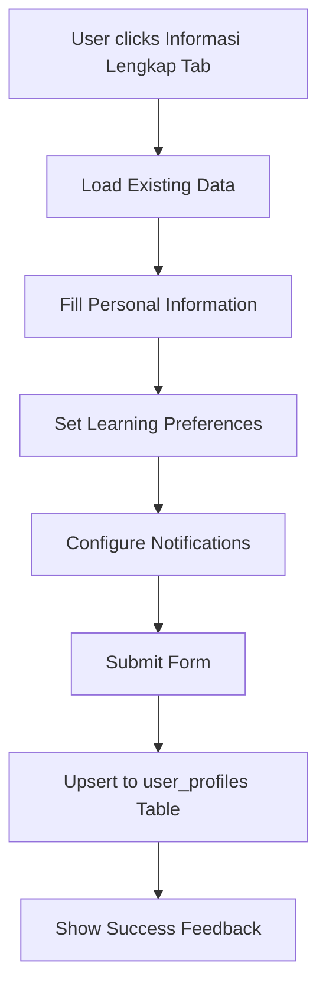

# 🎯 Profile Management Features

Dokumentasi lengkap untuk fitur-fitur Profile Management yang baru di Islamic Roadmap.

## 📋 Overview

Fitur Profile Management yang baru telah ditingkatkan dengan:
1. **🔐 Change Password** - Keamanan tingkat lanjut
2. **👤 Extended Profile Fields** - Informasi profil yang lebih lengkap
3. **🎨 Modern UI** - Interface dengan tab navigation yang user-friendly

## 🔧 Features Implemented

### 1. **Change Password Component** 
**File**: `src/components/ChangePassword.tsx`

#### ✨ Fitur:
- ✅ **Current Password Verification** - Verifikasi password lama
- ✅ **Password Strength Indicator** - Visual indicator kekuatan password
- ✅ **Real-time Validation** - Validasi langsung saat mengetik
- ✅ **Show/Hide Password** - Toggle visibility password
- ✅ **Comprehensive Validation**:
  - Minimal 8 karakter
  - Huruf besar & kecil
  - Angka & simbol
  - Password tidak boleh sama dengan yang lama

#### 🎨 UI Elements:
```tsx
// Password strength indicator
<PasswordStrengthIndicator password={newPassword} />

// Visual feedback
- Lemah: Red progress bar
- Sedang: Yellow progress bar  
- Kuat: Green progress bar
```

#### 🔒 Security Features:
- Verifikasi password lama sebelum update
- Encrypted password handling via Supabase Auth
- Automatic form reset setelah sukses

### 2. **Extended Profile Form Component**
**File**: `src/components/ExtendedProfileForm.tsx`

#### 📋 Personal Information:
```tsx
- first_name: string
- last_name: string
- bio: string (textarea)
- location: string
- phone: string
- date_of_birth: date
```

#### 🎓 Learning Preferences:
```tsx
- preferred_language: 'indonesia' | 'english' | 'arabic'
- learning_level: 'beginner' | 'intermediate' | 'advanced'
- favorite_topics: string[] (checkbox multiple)
- study_time_preference: 'morning' | 'afternoon' | 'evening' | 'night'
```

#### 🔔 Notification Settings:
```tsx
- notification_email: boolean
- notification_reminders: boolean
```

### 3. **Enhanced UserProfile Component**
**File**: `src/components/UserProfile.tsx`

#### 🎨 Modern UI Design:
- **Header Section**: Gradient background dengan avatar upload
- **Tab Navigation**: 3 tabs dengan icons
  - 👤 **Profil Dasar** - Basic user info
  - 📝 **Informasi Lengkap** - Extended profile
  - 🔒 **Keamanan** - Password management

#### 📱 Responsive Design:
- Mobile-first approach
- Grid layout untuk desktop
- Touch-friendly interface

## 🗄️ Database Schema

### **user_profiles Table**
```sql
CREATE TABLE user_profiles (
  id UUID PRIMARY KEY,
  user_id UUID REFERENCES auth.users(id),
  
  -- Personal Info
  first_name TEXT,
  last_name TEXT,
  bio TEXT,
  location TEXT,
  phone TEXT,
  date_of_birth DATE,
  
  -- Learning Preferences  
  preferred_language TEXT DEFAULT 'indonesia',
  learning_level TEXT DEFAULT 'beginner',
  favorite_topics TEXT[] DEFAULT '{}',
  study_time_preference TEXT DEFAULT 'evening',
  
  -- Notifications
  notification_email BOOLEAN DEFAULT true,
  notification_reminders BOOLEAN DEFAULT true,
  
  -- Metadata
  created_at TIMESTAMP DEFAULT NOW(),
  updated_at TIMESTAMP DEFAULT NOW()
);
```

### **Storage Buckets**
```sql
-- Avatar storage
INSERT INTO storage.buckets (id, name, public)
VALUES ('avatars', 'avatars', true);
```

### **Row Level Security (RLS)**
```sql
-- Users can only access their own profile
CREATE POLICY "Users can view own profile" ON user_profiles
  FOR SELECT USING (auth.uid() = user_id);
```

## 🚀 Setup Instructions

### 1. **Database Setup**
```bash
# Run SQL script in Supabase SQL Editor
cat database-schema.sql | supabase db sql
```

### 2. **Component Integration**
```tsx
// Import components
import { ChangePassword } from './ChangePassword'
import { ExtendedProfileForm } from './ExtendedProfileForm'

// Use in UserProfile
{activeTab === 'security' && <ChangePassword />}
{activeTab === 'extended' && <ExtendedProfileForm />}
```

### 3. **Environment Variables**
```bash
# .env
PUBLIC_SUPABASE_URL=your_supabase_url
PUBLIC_SUPABASE_ANON_KEY=your_supabase_key
```

## 📊 User Flow

### **Change Password Flow**


### **Extended Profile Flow**


## 🎯 Key Benefits

### **🔐 Security Improvements**
- **Enhanced Password Security**: Strong password requirements
- **Current Password Verification**: Prevents unauthorized changes
- **Visual Security Feedback**: Users understand password strength

### **👤 Better User Experience**
- **Complete Profile Management**: All-in-one interface
- **Personalized Learning**: Preferences-based content
- **Modern UI**: Clean, intuitive design

### **📊 Data Collection**
- **Learning Analytics**: Understanding user preferences
- **Notification Management**: Better engagement control
- **Profile Completeness**: Encouraging full profile setup

## 🛠️ Technical Implementation

### **State Management**
```tsx
// Zustand store integration
const { user } = useAuthStore()

// Local component state
const [profileData, setProfileData] = useState<ExtendedProfile>({
  // ... default values
})
```

### **API Integration**
```tsx
// Supabase operations
const { error } = await supabase
  .from('user_profiles')
  .upsert({
    user_id: user?.id,
    ...profileData,
    updated_at: new Date().toISOString()
  })
```

### **Form Validation**
```tsx
// Password validation
const validatePassword = (password: string) => {
  if (password.length < 8) return 'Password minimal 8 karakter'
  if (!/[A-Z]/.test(password)) return 'Harus ada huruf besar'
  // ... more checks
}
```

## 🎨 UI/UX Features

### **Interactive Elements**
- **Password Strength Meter**: Real-time visual feedback
- **Avatar Upload**: Click-to-upload dengan progress
- **Tab Navigation**: Smooth transitions between sections
- **Form Validation**: Inline error messages

### **Accessibility**
- **Keyboard Navigation**: Tab-accessible interface
- **Screen Reader Support**: Proper ARIA labels
- **Color Contrast**: Meets WCAG guidelines
- **Focus Management**: Clear focus indicators

## 🧪 Testing

### **Manual Testing Checklist**
- [ ] Change password with various strength levels
- [ ] Fill extended profile completely
- [ ] Upload and change avatar
- [ ] Switch between tabs
- [ ] Submit forms with validation errors
- [ ] Test on mobile devices

### **Database Testing**
```sql
-- Check if profile is created
SELECT * FROM user_profiles WHERE user_id = 'your-user-id';

-- Test RLS policies
SELECT * FROM user_profiles; -- Should only show current user's data
```

## 🚀 Future Enhancements

### **Next Phase Features**
1. **🏆 Achievement System** - Badges for profile completion
2. **📈 Learning Analytics** - Progress based on preferences  
3. **🌙 Theme Customization** - Dark/light mode toggle
4. **🔗 Social Integration** - Share profile achievements
5. **📱 Mobile App** - React Native companion

### **Technical Improvements**
1. **Real-time Updates** - WebSocket for live changes
2. **Image Optimization** - Auto-compress uploaded avatars
3. **Data Export** - GDPR compliance features
4. **Advanced Security** - 2FA implementation

## 📞 Support

Jika ada pertanyaan atau butuh bantuan:
- 📧 **Email**: adrhmnhkm@gmail.com
- 🐛 **Issues**: GitHub Issues
- 💬 **Discussion**: GitHub Discussions

---

💡 **Pro Tip**: Lengkapi profil untuk mendapatkan rekomendasi pembelajaran yang lebih personal! 